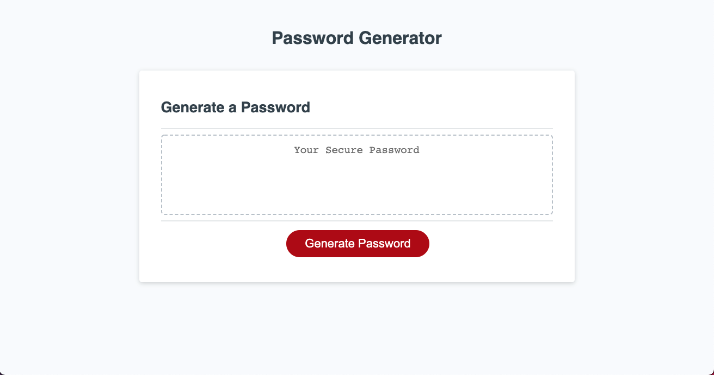
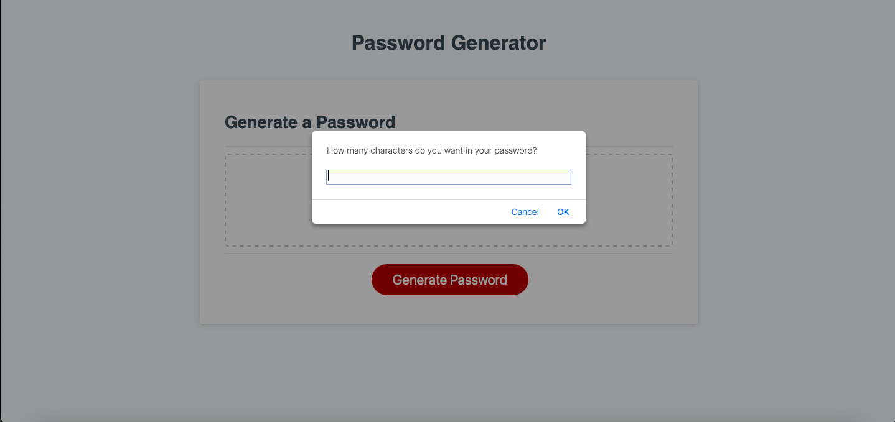
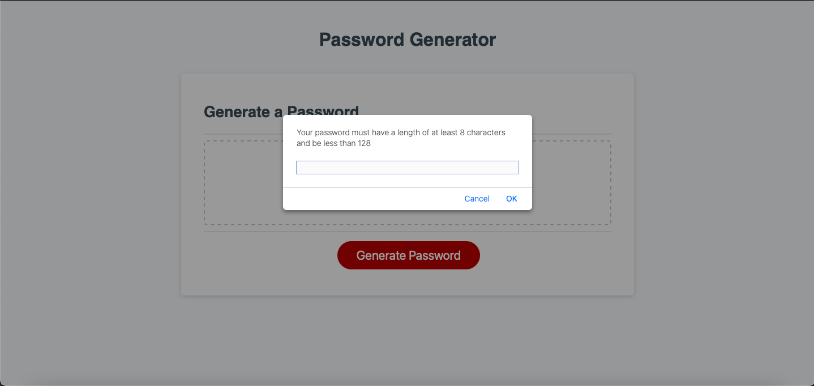
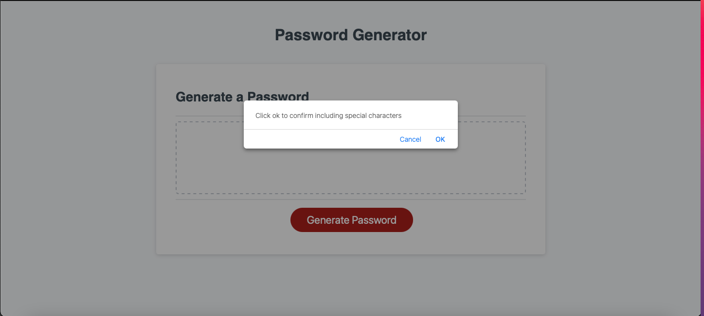
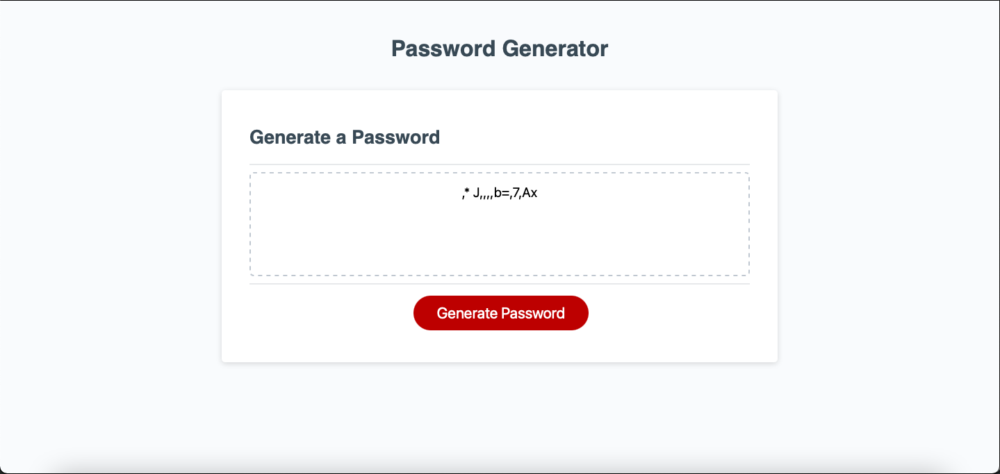

# Password-Generator

## Description
This project was a homework dessigned for the ITESM Bootcamp, in which we were supossed play with some basic Javascript feaures to be more familiarized with them. We needed to include the functionality to a given "Password Generator" made with HTML and CSS.

## Installation
This project has been deployed to GitHub. To get this project up and running, you can follow the deployment link.

https://github.com/Eduadomtz/Password-Generator

## Usage

The project offers an interface created with HTML, CSS and Javascript. 

The first view is presents a button that will send you a series of prompts and confirrms. 

When you press the button "Generate Password" a prompt will appear asking you the length of your password.

If you type a value smaller than 8 or bigger than 128 an other prompt will appear asking you to type a valid value (between 8 and 128).

Then they will appear 4 confirm windows gathering data to create you random password.

Finally your password will be display on the screen

## Features
HTML Pages
Index.html

CSS Page
Styles.css

Javascript Page
